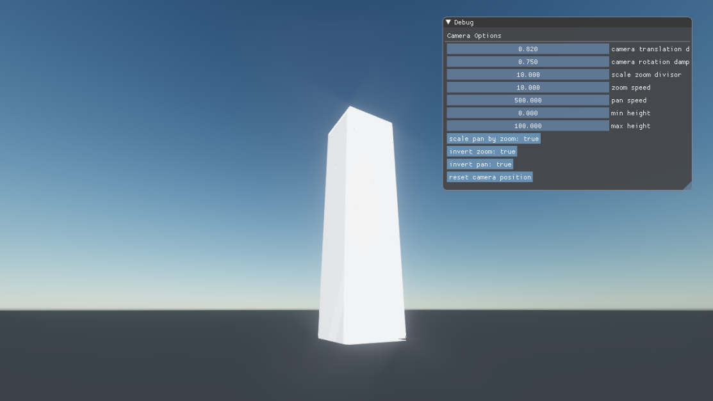

dear-xenko (obsolete)
---------------------
Scratchpad repository for showing ImGui.NET integration with Xenko, also accidentally includes some other stuff, oops.

Project is for Xenko 3.0.6

**Largely superseded by a new repo, go here instead**: [Xenko.Extensions](https://github.com/jazzay/Xenko.Extensions#xenkoimgui) which is where work will continue.

